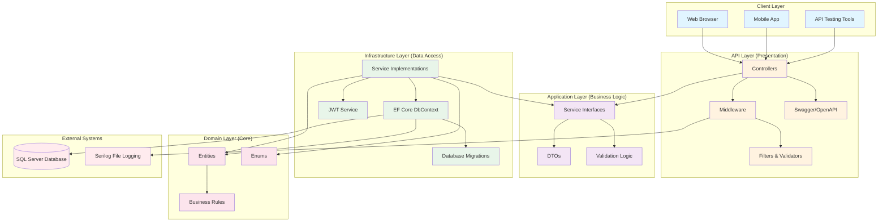

# Component Diagram - Monolith Architecture

## Mô tả
Sơ đồ kiến trúc Monolith của hệ thống EV Rental System, thể hiện cấu trúc Clean Architecture với 4 layers.

---

## Sơ đồ Mermaid

---

## Chi tiết các thành phần

### **1. Client Layer**
- **Web Browser**: Giao diện web (future)
- **Mobile App**: Ứng dụng di động (future)
- **API Testing Tools**: Postman, Swagger UI

### **2. API Layer (Presentation)**
- **Controllers**: 
  - AuthController
  - BookingsController
  - RentalsController
  - VehiclesController
  - StationsController
  - PaymentsController
  - MaintenanceController
  - AdminController
  - HealthController
- **Middleware**: Exception handling, logging
- **Filters**: ValidateModelAttribute
- **Swagger**: API documentation

### **3. Application Layer (Business Logic)**
- **DTOs**: Request/Response models
  - Auth DTOs
  - Booking DTOs
  - Rental DTOs
  - Vehicle DTOs
  - Payment DTOs
  - Maintenance DTOs
  - Admin DTOs
- **Interfaces**: Service contracts
  - IAuthService
  - IBookingService
  - IRentalService
  - IVehicleService
  - IStationService
  - IPaymentService
  - IMaintenanceService
  - IAdminService
  - IJwtService

### **4. Infrastructure Layer (Data Access)**
- **Service Implementations**: Business logic implementation
- **DbContext**: Entity Framework Core context
- **Migrations**: Database schema versioning
- **JWT Service**: Token generation and validation

### **5. Domain Layer (Core)**
- **Entities**: 
  - User
  - Station
  - Vehicle
  - Booking
  - Rental
  - VehicleInspection
  - Payment
  - MaintenanceSchedule
  - MaintenanceRecord
- **Enums**: 
  - UserRole
  - VehicleStatus
  - BookingStatus
  - RentalStatus
  - PaymentStatus
  - PaymentType
  - MaintenanceType
  - MaintenanceStatus
- **Business Rules**: Domain validation logic

### **6. External Systems**
- **SQL Server**: Primary database
- **Serilog**: File-based logging system

---

## Luồng dữ liệu

1. **Client → API Layer**: HTTP Request
2. **API Layer → Application Layer**: DTO validation
3. **Application Layer → Infrastructure Layer**: Service call
4. **Infrastructure Layer → Domain Layer**: Entity manipulation
5. **Domain Layer → Database**: Data persistence
6. **Database → Client**: Response chain

---

## Ưu điểm của Monolith Architecture

✅ **Đơn giản**: Dễ phát triển, dễ deploy  
✅ **Performance**: Không có network latency giữa các services  
✅ **Transaction**: ACID transactions dễ dàng  
✅ **Debugging**: Dễ debug và trace  
✅ **Testing**: Dễ viết integration tests  

---

## Nhược điểm

⚠️ **Scalability**: Khó scale từng phần riêng lẻ  
⚠️ **Deployment**: Phải deploy toàn bộ app khi có thay đổi nhỏ  
⚠️ **Technology Lock-in**: Khó thay đổi technology stack  
⚠️ **Team Coordination**: Nhiều team làm chung 1 codebase  

---

## Khi nào nên chuyển sang Microservices?

- Khi hệ thống có > 100,000 users
- Khi cần scale riêng từng module
- Khi có nhiều team (> 5 teams)
- Khi cần deploy độc lập từng service

---

**Kết luận**: Với quy mô hiện tại (dự án học tập/startup nhỏ), **Monolith Architecture là lựa chọn phù hợp**.

