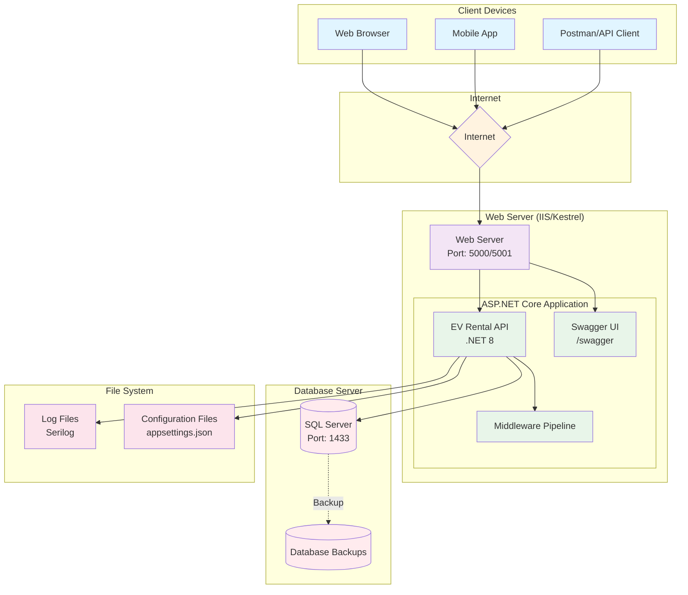

# Deployment Diagram - Simple Deployment

## Mô tả
Sơ đồ triển khai đơn giản của hệ thống EV Rental System, phù hợp cho môi trường development và production nhỏ.

---

## Sơ đồ Mermaid



---

## Chi tiết triển khai

### **1. Client Devices**
- **Web Browser**: Chrome, Firefox, Edge, Safari
- **Mobile App**: iOS/Android (future)
- **API Client**: Postman, Insomnia, curl

### **2. Web Server**
- **Platform**: Windows Server / Linux
- **Runtime**: .NET 8 Runtime
- **Web Server**: 
  - **Development**: Kestrel (built-in)
  - **Production**: IIS (Windows) hoặc Nginx (Linux)
- **Ports**:
  - HTTP: 5000
  - HTTPS: 5001
- **SSL/TLS**: Let's Encrypt hoặc self-signed certificate

### **3. ASP.NET Core Application**
- **Framework**: .NET 8
- **Architecture**: Clean Architecture (Monolith)
- **Components**:
  - API Controllers (9 controllers)
  - Middleware Pipeline
  - Swagger UI
  - JWT Authentication
  - Serilog Logging

### **4. Database Server**
- **DBMS**: Microsoft SQL Server 2019+
- **Port**: 1433
- **Authentication**: SQL Server Authentication
- **Connection String**: Encrypted in appsettings.json
- **Backup Strategy**: 
  - Full backup: Daily
  - Transaction log backup: Hourly

### **5. File System**
- **Log Files**: 
  - Location: `logs/` folder
  - Format: JSON structured logs
  - Rotation: Daily (log-YYYYMMDD.txt)
  - Retention: 30 days
- **Configuration Files**:
  - `appsettings.json` (default)
  - `appsettings.Development.json`
  - `appsettings.Production.json`

---

## Deployment Options

### **Option 1: Single Server (Development/Small Production)**

```
┌─────────────────────────────────┐
│   Single Server (Windows/Linux) │
│                                 │
│  ┌──────────────────────────┐  │
│  │  Web Server (Kestrel)    │  │
│  │  Port: 5000/5001         │  │
│  └──────────────────────────┘  │
│                                 │
│  ┌──────────────────────────┐  │
│  │  SQL Server Express      │  │
│  │  Port: 1433              │  │
│  └──────────────────────────┘  │
│                                 │
│  ┌──────────────────────────┐  │
│  │  File System (Logs)      │  │
│  └──────────────────────────┘  │
└─────────────────────────────────┘
```

**Ưu điểm**: Đơn giản, chi phí thấp  
**Nhược điểm**: Single point of failure, khó scale  
**Phù hợp**: Development, Demo, Startup nhỏ

---

### **Option 2: Separated Database Server (Recommended)**

```
┌──────────────────────┐      ┌──────────────────────┐
│   Web Server         │      │   Database Server    │
│                      │      │                      │
│  ┌────────────────┐ │      │  ┌────────────────┐ │
│  │  API (.NET 8)  │ │◄────►│  │  SQL Server    │ │
│  │  Port: 5000    │ │      │  │  Port: 1433    │ │
│  └────────────────┘ │      │  └────────────────┘ │
│                      │      │                      │
│  ┌────────────────┐ │      │  ┌────────────────┐ │
│  │  Logs          │ │      │  │  Backups       │ │
│  └────────────────┘ │      │  └────────────────┘ │
└──────────────────────┘      └──────────────────────┘
```

**Ưu điểm**: Tách biệt concerns, dễ backup, bảo mật tốt hơn  
**Nhược điểm**: Chi phí cao hơn, cần network configuration  
**Phù hợp**: Production, Medium-sized applications

---

### **Option 3: Cloud Deployment (Azure/AWS)**

```
┌─────────────────────────────────────────────────┐
│              Azure Cloud / AWS                  │
│                                                 │
│  ┌──────────────────────────────────────────┐  │
│  │  Azure App Service / AWS Elastic Beanstalk│ │
│  │  (Web API)                                │  │
│  └──────────────────────────────────────────┘  │
│                                                 │
│  ┌──────────────────────────────────────────┐  │
│  │  Azure SQL Database / AWS RDS             │  │
│  │  (Managed SQL Server)                     │  │
│  └──────────────────────────────────────────┘  │
│                                                 │
│  ┌──────────────────────────────────────────┐  │
│  │  Azure Blob Storage / AWS S3              │  │
│  │  (Logs, Backups)                          │  │
│  └──────────────────────────────────────────┘  │
└─────────────────────────────────────────────────┘
```

**Ưu điểm**: Auto-scaling, high availability, managed services  
**Nhược điểm**: Chi phí cao, vendor lock-in  
**Phù hợp**: Large production, Enterprise

---

## Deployment Steps (Option 2 - Recommended)

### **Bước 1: Chuẩn bị Database Server**

```bash
# 1. Cài đặt SQL Server 2019+
# 2. Tạo database
CREATE DATABASE EVRentalDB;

# 3. Tạo user cho application
CREATE LOGIN evrentaluser WITH PASSWORD = 'YourStrongPassword123!';
USE EVRentalDB;
CREATE USER evrentaluser FOR LOGIN evrentaluser;
ALTER ROLE db_owner ADD MEMBER evrentaluser;
```

### **Bước 2: Chuẩn bị Web Server**

```bash
# 1. Cài đặt .NET 8 Runtime
# Download từ: https://dotnet.microsoft.com/download/dotnet/8.0

# 2. Verify installation
dotnet --version

# 3. Tạo thư mục deploy
mkdir /var/www/evrentalapi
cd /var/www/evrentalapi
```

### **Bước 3: Build và Publish Application**

```bash
# 1. Build project
dotnet build --configuration Release

# 2. Publish
dotnet publish src/EVRentalSystem.API/EVRentalSystem.API.csproj \
  --configuration Release \
  --output /var/www/evrentalapi

# 3. Copy appsettings.Production.json
cp appsettings.Production.json /var/www/evrentalapi/
```

### **Bước 4: Cấu hình Connection String**

```json
// appsettings.Production.json
{
  "ConnectionStrings": {
    "DefaultConnection": "Server=YOUR_DB_SERVER;Database=EVRentalDB;User Id=evrentaluser;Password=YourStrongPassword123!;TrustServerCertificate=True;"
  },
  "Jwt": {
    "SecretKey": "YOUR_PRODUCTION_SECRET_KEY_AT_LEAST_32_CHARACTERS_LONG",
    "Issuer": "https://yourdomain.com",
    "Audience": "https://yourdomain.com"
  }
}
```

### **Bước 5: Chạy Migration**

```bash
cd /var/www/evrentalapi
dotnet ef database update --project EVRentalSystem.Infrastructure.dll
```

### **Bước 6: Chạy Application**

```bash
# Development (Kestrel)
dotnet EVRentalSystem.API.dll

# Production (với systemd service - Linux)
sudo systemctl start evrentalapi
sudo systemctl enable evrentalapi

# Production (với IIS - Windows)
# Configure IIS Application Pool và Website
```

---

## Security Checklist

- [ ] HTTPS enabled (SSL/TLS certificate)
- [ ] JWT Secret Key đủ mạnh (>= 32 characters)
- [ ] Database connection string encrypted
- [ ] SQL Server authentication (không dùng sa account)
- [ ] Firewall rules (chỉ mở port 443/5001)
- [ ] CORS policy configured
- [ ] Rate limiting enabled
- [ ] Logging không chứa sensitive data
- [ ] Regular security updates

---

## Monitoring & Maintenance

### **Logs**
- Location: `/var/www/evrentalapi/logs/`
- Format: JSON structured logs
- Rotation: Daily
- Monitoring: Check for ERROR/FATAL logs daily

### **Database**
- Backup: Daily full backup + hourly transaction log
- Monitoring: CPU, Memory, Disk space
- Maintenance: Weekly index rebuild

### **Application**
- Health Check: `GET /api/health`
- Monitoring: Response time, error rate
- Restart: Automatic restart on failure (systemd/IIS)

---

**Kết luận**: Với quy mô hiện tại, **Option 2 (Separated Database Server)** là lựa chọn tối ưu cho production deployment.

